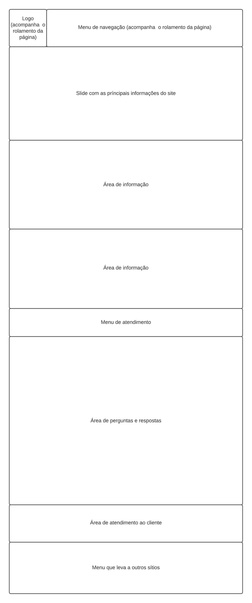
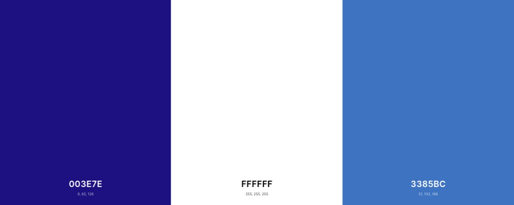
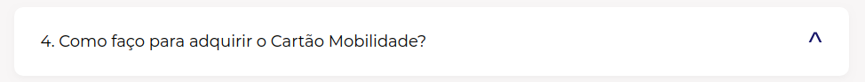
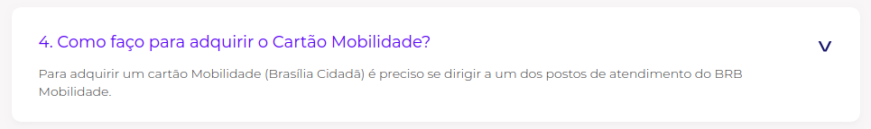

# Guia de Estilo

## 1. Introdução

### 1.1. Objetivo

 Este guia de estilo tem como função registrar as decisões de design relacionadas a implementação do site BRB Mobilidade. O guia de estilo serve como uma ferramenta para comunicação entre a equipe de design e equipe de desenvolvimento.

### 1.2. Organização e conteúdo do guia de estilo

Esse guia de estilo irá arbodar os seguintes tópicos:

* 1 - Introdução
* 2 - Resultados de Análise
* 3 - Elementos de Interface
* 4 - Elementos de Interação
* 5 - Elementos de Ação
* 6 - vocabulário e Padrões

### 1.3. Público-Alvo do guia de estilo

O público-alvo são os programadores do site, ou qualquer pessoa da esquipe que irá gerir a parte de design do site.

### 1.4. Como utilizar o guia

O guia deve ser utilizado como parte de um processo reflexivo de design, assim auxiliando na criação e correção do design.

### 1.5. Como manter o guia

O guia do estilo segue o processo de engenharia de usabilidade de Mayhew para sua manutenbilidade.

## 2. Resultados de análise

### 2.1. Descrição do ambiente de trabalho do usuário

O BRB Mobilidade é um site na web que utiliza botões para a sua navegação, com páginas rolantes, em outro sítio do site ele também utiliza de mapas para exemplificar aquilo o que ele esta informando, ele também utiliza de um interface minimalista, com um menu de navegação que acompanha o rolamneto da página.

## 3. Elementos Interface

### 3.1. Disposição espacial e grid

### 3.2. Janelas

O layout deve seguir a proporção de acordo com o tamanho da tela, se ajustando de acordo com a resolução.

### 3.3. Tipografia

A fonte utilizada, tanto para títulos quanto para textos, é Arial, sendo o tamanho 23 para titulos e 11 para textos.

### 3.4. Símbolos não tipográficos

Os símbolos foram utilizados para dar acesso a sites parceiros, e os QRCodes foram utilizados para divulgar o app do BRB Mobilidae.

### 3.5. Cores

Seguindo o padrão de cores do BRB, a paleta de cores para o BRBMobilidade fica:

### 3.6. Animação

O site possui animação no inicio de sua página principal, um slide que apresenta informação do site, que é atualizada com o tempo.

# 4. Elementos de interação
## 4.1. Estilos de interação 
Para o padrão de botões de interação, devem ser usados os seguintes estilos

 | Estilo 1| Estilo 2 |
 |:-------------:|:--------------: |
 |  | | 
 
## 4.2. Seleção de um estilo
O **estilo 1** deve ser prioridade, o **estilo 2** deve ser usado quando houverem botões secundários em uma mesma área.
## 4.3. Aceleradores (teclas de atalho)
Não são necessárias teclas de atalho durante o uso do site.
# 5. Elementos de ação
## 5.1. Preenchimento de campos
Caso hajam campos a serem preenchidos, devem ser feitos usando o padrão de cores da paleta e a fonte arial seguindo a tipografia.
## 5.2. Ativação
As ações de ativação do site serão limitadas a abertura de divisórias com textos informativos: 

Não ativado:

Ativado:

# 6. Vocabulário e padrões
## 6.1. Terminologia
É desejável o mínimo uso de siglas e termos técnicos durante o site. Já que se trata de um site com alta necessidade de acessibilidade e é usado como suporte pelo usuário.

## 6.2. Tipos de tela

Pretende-se usar a tela padrão já usada no site, onde cada aba apenas altera as informações da parte abaixo da logo e menu de navegação.

## Versionamento
| Versão| Data| Alteração | Integrante |
| :------------- :|:--------------:| :-----------:|:----------:|
| 1.0| 13/10 |Criação dos tópicos 1, 2 e 3, e todos seus subtópicos| [Danilo Domingo](https://github.com/danilow200)|
| 1.1| 14/10 |Criação dos tópicos 4 e 5, melhorias nos tópicos 1 e 3 |[Arthur Paiva](https://github.com/arthurpaivat)|