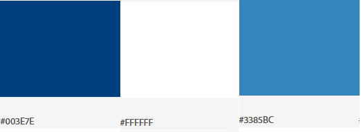

# Guia de Estilo

# 1. Introdução

## 1.1. Objetivo

O guia de estilo serve como uma ferramenta para comunicação entre a equipe de desing e equipe de desenvolvimento. Este guia de estilo tem como função registrar as decisões de desing relacionadas a implementação do site BRB Mobilidade.

## 1.2. Organização e conteúdo do guia de estilo

Esse guia de estilo irá arboda os seguintes tópicos:

* 1 - Introduçao
* 2 - Resultados de Análise
* 3 - Elementos de Interface
* 4 - Elementos de Interação
* 5 - Elementos de Ação
* 6 - vocabulário e Padrões

## 1.3. Público-Alvo do guia de estilo

O público-alvo são os programadores do site, ou qualquer pessoa da esquipe que irá gerir a parte de design do site.

## 1.4. Como utilizar o guia

O guia deve ser utilizado como parte de um processo reflexivo de design, assim auxiliando na criação e correção do design.

## 1.5. Como manter o guia

O guia do estilo segue o processo de engenharia de usabilidade de Mayhew para sua manutenbilidade.

# 2. Resultados de análise

## 2.1. Descrição do ambiente de trabalho do usuário

O BRB Mobilidade é um site na web que utiliza botões para a sua navegação, com páginas rolantes, em outro sítio do site ele também utiliza de mapas para exemplificar aquilo o que ele esta informando, ele também utiliza de um interface minimalista, com um menu de navegação que acompanha o rolamneto da página.

# 3. Elementos Interface

## 3.1. Disposição espacial e grid

## 3.2. Janelas

O layout deve seguir a proporção de acordo com o tamanho da tela, se ajustando de acordo com a resolução.

## 3.3. Tipografia

A fonte utilizada, tanto para títulos quanto para textos, é Arial, sendo o tamanho 23 para titulos e 11 para textos.

## 3.4. Símbolos não tipográficos

Os símbolos foram utilizados para dar acesso a sites parceiros, e os QRCodes foram utilizados para divulgar o app do BRB Mobilidae.

## 3.5. Cores

O padrão de cor é:

## 3.6. Animação

O site possui animação no inicio de sua página principal, um slide que apresenta informação do site, que é atualizada com o tempo.

## Versionamento
| Versão| Data| Alteração | Integrante |
| :------------- :|:--------------:| :-----------:|:----------:|
| 1.0| 13/10 |Criação dos tópicos 1, 2 e 3, e todos seus subtópicos| [Danilo Domingo](https://github.com/danilow200)|