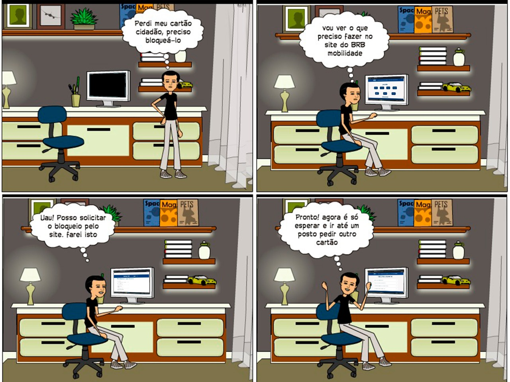

# StoryBoard

Storyboard ou Esboço sequencial são organizadores gráficos tais como uma série de ilustrações ou imagens arranjadas em sequência, no caso representando sequências de ações relacionadas ao uso do BRBMobilidade.

## Bloqueio de Cartão

