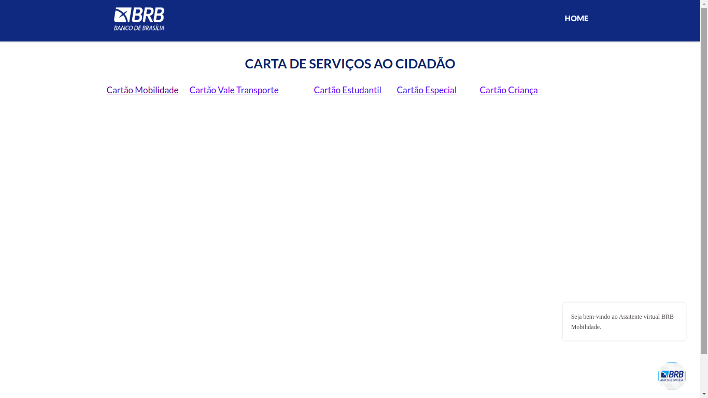

# BRB Mobilidade

[Site](https://mobilidade.brb.com.br/)

## Sobre a escolha do site
  Foram sugeridos alguns sites para servir de matérial de estudo, elencados na nesta [apresentação](https://interacao-humano-computador.github.io/2020.1-BRBMobilidade/apresenta%C3%A7%C3%B5es/apresentacoes/#planejamento-do-projeto),mas em virtude do site BRB Mobilidade apresentar alguns problemas de usabilidade - elencado um desses problemas abaixo - o grupo decidiu pelo escolha dele.

## As técnicas e ferramentas utilizadas

Para elaboração desse projeto foi essencial a ulização das ferramentas:

[Figma](https://www.figma.com/): Para elaboração do Protótipo de alta fidelidade em [Planejamento de Avaliação - Protótipo de Alta fidelidade](https://interacao-humano-computador.github.io/2020.1-BRBMobilidade/prototipacao/planejamentoPrototipoAltaFidelidade/)

[Pixton](https://www.pixton.com/): Para elaboração do [Storyboard](https://interacao-humano-computador.github.io/2020.1-BRBMobilidade/planejamento/storyboard/)

[Youtube](https://www.youtube.com/): Para disponibilização dos vídeos gravados na [Apresentações](https://interacao-humano-computador.github.io/2020.1-BRBMobilidade/apresenta%C3%A7%C3%B5es/apresentacoes/)

## As facilidades e dificuldades encontradas para a realização do projeto.

É importate resaltar que o curso de Engenharia de Software na Universidade de Brasília é um curso presencial. E devido a esse fato, o grupo obteve inicialmente uma dificuldade em se adaptar ao sistema de educação à distância, mas nada que o prejuticasse o aprendizado em relação ao conteúdo ministrado na disciplina.

Tendo como base os repositórios disponibilizados na [organização](https://github.com/Interacao-Humano-Computador) da matéria de Interação Humano Computador no github, o grupo obeteve facilidade no aprendizado do conteúdo devido aos trabalhos disponibilizados por semestres anteriores.

## EQUIPE

Arthur Paiva | Danilo Domingo | Iago Theophilo | Gabriel Hussein
:-------------------------:|:-------------------------:|:-------------------------:|:-------------------------:
  |   |  |  

Wiki do site para desktop BRB Mobilidade para disciplina de interação humano computador 2020.1. Repositório criado para reúnir e analisar potenciais problemas de usabilidade ou interface do site BRB Mobilidade.