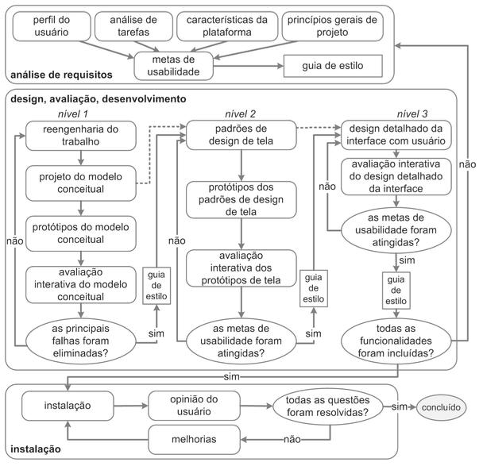
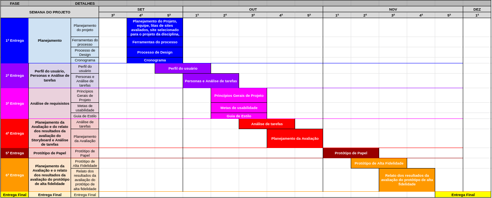

## Sobre
  O planejamento do projeto é extremamente importante pois irá ditar como o projeto será feito até o fim da disciplina. Trata de planejar, organizar e estruturar todas as atividades necessárias para analisar a interface do site de desktop BRB Mobilidade durante o semestre. O planejamento também é importante para conseguir ajudar integrantes do grupo a se organizar em relação as entregas necessárias.

## Organização dos integrantes
  Para conciliar com a outra matéria lecionada pelo professor André Barros utilizamos o mesmo planejamento de horários para que possamos discutir sobre os dois projetos sempre que necessário, por meio do google calendars conseguimos separar os horários disponíveis de cada integrante.

## Política de uso do repositório
  Para organizar de forma eficiente é recomendado que todo integrante e contribuinte do projeto siga um padrão na hora de _commitar_ e na hora de criar novas _branches_:

- Recomendado sempre criar a _branch_ com o nome da mudança ou adição ao repositório.
- Recomendado manter os _commits_ sempre com mensagens curtas e objetivas.
- O _pull request_ para a master será feita apenas após a verificação de outro integrante do grupo da mudança ter sido feita corretamente.

## Processo de design
  O processo de design a ser adotado pelo grupo será a engenharia de usabilidade de mayhew que consiste em três fases de avaliação de IHC, a análise de requisitos, o design, avaliação e desenvolvimento e a última fase que é a instalação:

## Cronograma
A equipe utilizará um cronograma que segue as datas de entrega para cada conteúdo da wiki

## Ferramentas utilizadas
| Ferramentas| Nome| Descrição |
| :------------- :|:--------------:| :-----------:|
| | Github|O Github será utilizado para versionamento e armazenamento de todos os documentos|
| | ZenHub |O Zenhub será utilizado para a organização e planejamento do grupo|
| | Telegram |O Telegram será utilizado para a comunicação do grupo|
| |  Microsoft Teams | O Microsoft Teams será utilizado para gravação das apresentações |
| |  [Figma](https://www.figma.com/) | Para elaboração do Protótipo de alta fidelidade em [Planejamento de Avaliação - Protótipo de Alta fidelidade](https://interacao-humano-computador.github.io/2020.1-BRBMobilidade/prototipacao/planejamentoPrototipoAltaFidelidade/) |
| |  [Pixton](https://www.pixton.com/) | Para elaboração do [Storyboard](https://interacao-humano-computador.github.io/2020.1-BRBMobilidade/planejamento/storyboard/) |
| |  Youtube | Para disponibilização dos vídeos gravados na [Apresentações](https://interacao-humano-computador.github.io/2020.1-BRBMobilidade/apresenta%C3%A7%C3%B5es/apresentacoes/) |

## Versionamento
| Versão| Data| Alteração | Integrante |
| :------------- :|:--------------:| :-----------:|:----------:|
| 1.0| 20/09 |Criação do pages e adição do planejamento e processo de design| [Gabriel Hussein](https://github.com/GabrielHussein)|
| 1.1| 02/10 |Criação do pages e adição do planejamento e processo de design| [Danilo Domingo](https://github.com/danilow200)|
| 1.2| 22/11 |Correção do processo de design| [Gabriel Hussein](https://github.com/GabrielHussein)|
| 1.3| 01/12 |Ferramentas utilizadas|[Iago Theophilo](https://github.com/IagoTheophilo)|