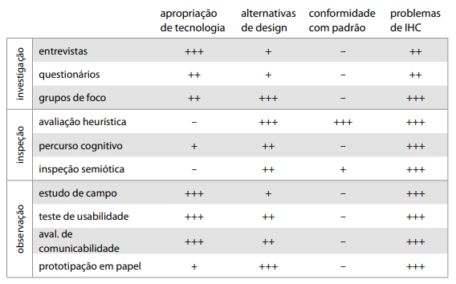

# Planejamento da avaliação

## Objetivos da avaliação

Os objetivos da avaliação, ou os dados que se esperam obter com a avaliação é dividida em 4 aspectos:

* Apropriação de tecnologia: É a forma de se avaliar como os usuários se apropriam dos sistemas computacionais interativos, esse aspecto pode ser coletado via entrevistas, estudos de campo, testes de usabilidade e avaliação de comunicabilidade.
* Alternativas de design: É o aspecto referente a diferentes ideias e alternativas de design de acordo com a necessidade do usuário, tempo de aprendizado, projeto para erros e recuperação ou apoio a erros são algumas das características levadas em consideração, geralmente coletado via grupos de foco, avaliação heurística e prototipação em papel.
* Conformidade com padrão: A conformidade com um padrão é o aspecto para avaliar a acessibilidade do sistema a portadores de alguma deficiência ou se segue os padrões estabelecidos pelo próprio sistema, também é avaliado o Sistema Operacional que o sistema é introduzido. Geralmente é coletado via avaliação por inspeção considerando algum conjunto de recomendações, guia de estilo ou norma. 
* Problemas de IHC: É o aspecto utilizado para verificar problemas relacionados a UX e UI com diferentes graus de impacto ao sistema medidos de acordo com a frequência e o quão disruptivo é para as ações do usuário. É coletado com a ajuda do usuário ou não e se utiliza de todos os métodos mencionados anteriormente.

Figura 1. Métodos de avaliação e o quão recomendados são para cada aspecto.

## Métodos de avaliação

Para cobrir o máximo de aspectos possíveis e utilizaremos de dois métodos: __Inspeção__ e __Investigação__

A Inspeção envolve o ponto de vista do avaliador e uma solução de IHC é utilizada para prever experiências de uso, esse método não envolve diretamente o usuário e suas experiências, e sim experiência de usos potenciais, esse método consiste em 3 atividades: 

* Avaliação heurística
* Percurso cognitivo
* Inspeção semiótica

A Investigação envolve diretamente o usuário para coletar opiniões e sugestões para analisar o que o usuário espera da aplicação e também consiste em 3 atividades:

* Entrevistas
* Questionários
* Grupos de foco

## Escopo da avaliação

A avaliação é baseada em coletar opiniões e sugestões do usuário em relação ao site, tentando coletar o máximo possível via os métodos definidos. Um número de tarefas serão designadas para o usuário realizar no site BRBMobilidade avaliando problemas durante o processo de realização dessas tarefas, essas tarefas são:

* Tentar recarregar o cartão
* Procurar o ponto de recarga mais próximo
* Buscar a linha de ônibus desejada
* Solicitar bloqueio de cartão
* Solicitar 2ª de cartão

## Perfis dos usuários

A avaliação consistirá de 4 usuários sendo cada um de um tipo de persona diferente estabelecido anteriormente pelo grupo. Essa decisão foi tomada pois cada usuário possui um grau de familiaridade diferente com o site.

## Referências
Interação Humano-Computador(Bruno Santana da Silva e Simone Diniz Junqueira Barbosa, 2010)

## Versionamento
| Versão| Data| Alteração | Integrante |
| :------------- :|:--------------:| :-----------:|:----------:|
| 1.0| 28/10 |Adição do planejamento da avaliação| [Gabriel Hussein](https://github.com/GabrielHussein)|

