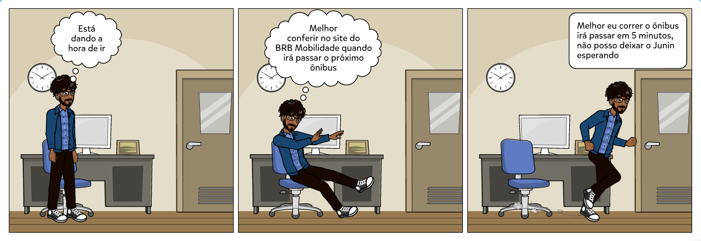
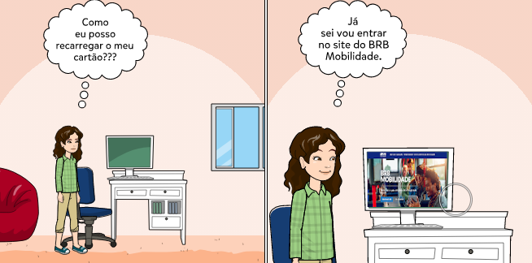
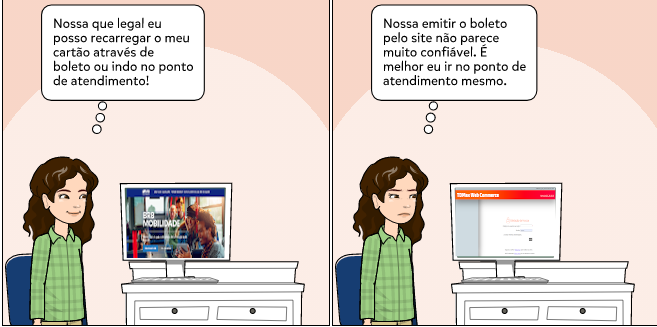

# StoryBoard

Storyboard ou Esboço sequencial são organizadores gráficos tais como uma série de ilustrações ou imagens arranjadas em sequência, no caso representando sequências de ações relacionadas ao uso do BRBMobilidade.
## Ferramentas

Utilizamos [pixton](https://www.pixton.com/) para nos auxiliar na elaboração dos storyboards e padronização das artes. 
## Bloqueio de Cartão

Referência [HTA](https://interacao-humano-computador.github.io/2020.1-BRBMobilidade/usu%C3%A1rios/an%C3%A1lise%20de%20tarefas/#analise-sobre-bloqueio-de-cartao)

## Linhas e Horários de Ônibus

Referência [HTA](https://interacao-humano-computador.github.io/2020.1-BRBMobilidade/usu%C3%A1rios/an%C3%A1lise%20de%20tarefas/#analise-sobre-linhas-e-horarios-de-onibus)

## Recarga de cartão

Referência [HTA](https://interacao-humano-computador.github.io/2020.1-BRBMobilidade/usu%C3%A1rios/an%C3%A1lise%20de%20tarefas/#analise-sobre-recarga-de-cartao)

## Versionamento
| Versão| Data| Alteração | Integrante |
| :------------- :|:--------------:| :-----------:|:----------:|
| 1.0| 28/10 | Adicionado storyboard de bloqueio de cartao|[Arthur Paiva](https://github.com/arthurpaivat)|
| 1.1| 28/10 | Adicionado storyboard das Linhas e Horários de Ônibus|[Danilo Domingo](https://github.com/danilow200)|
| 1.2| 28/10 | Adicionado storyboard da Recarga de cartão|[Iago Theophilo](https://github.com/IagoTheophilo)|