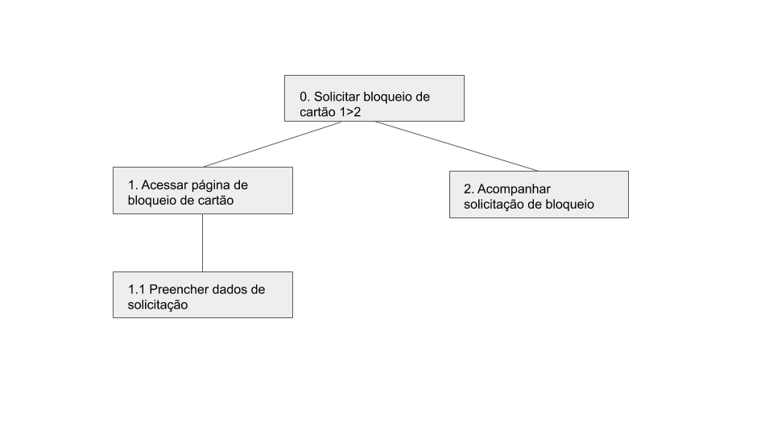
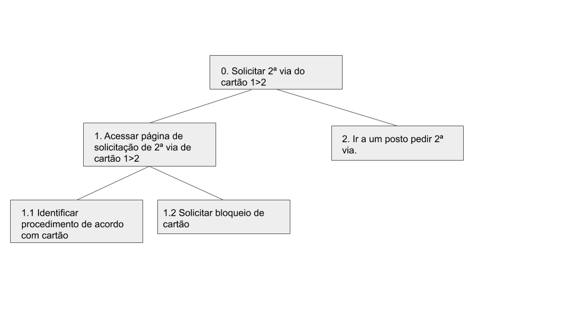
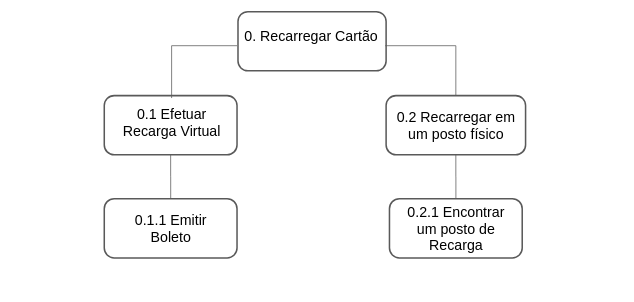
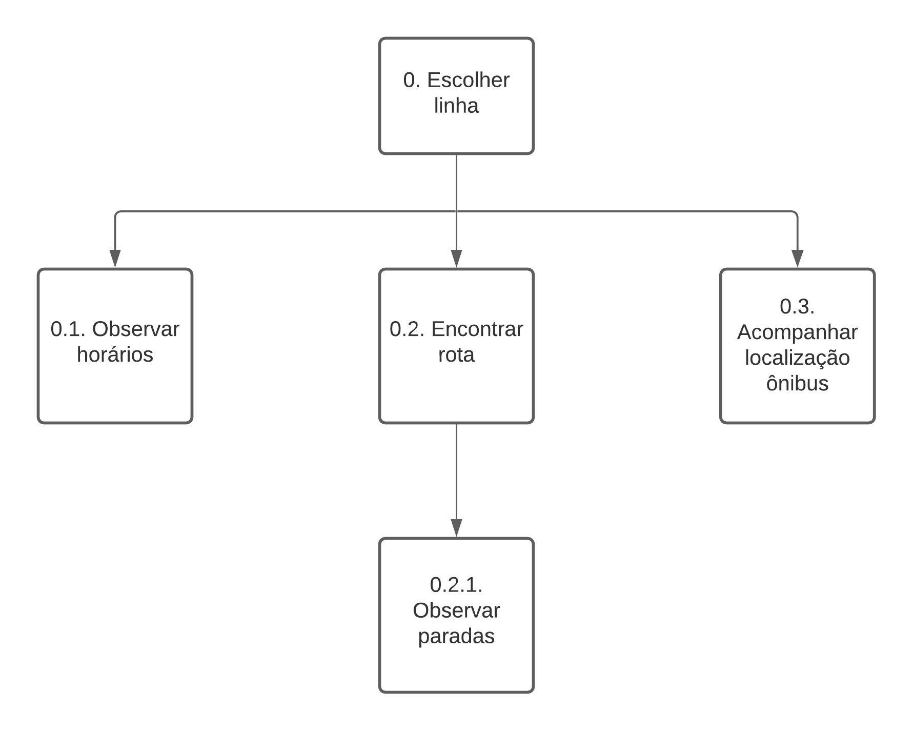
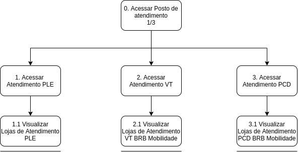

# Análise de tarefa HTA
 A análise de tarefas é utilizada para se entender sobre qual é o trabalho dos usuários, como eles o realizam e por quê. Nesse tipo de análise, o trabalho é definido em termos dos objetivos que os usuários querem ou precisam atingir. Dentre as análises de tarefas a escolhida para o projeto da displicina foi a HTA - _Hierarchical Task Analysis_ ou Análise Hierárquica de tarefas, foi desenvolvida na década de 1960 para entender as competências e habilidades exibidas em tarefas complexas e não repetitivas. Ela ajuda a relacionar o que as pessoas fazem(ou se recomenda que façam), porque o fazem, e quais as consequências caso não o façam corretamente. Ela se baseia em psicologia funcional, e não comportamental, como eram as abordagens da época em que foi criada.

### __Análise sobre bloqueio de cartão__

* Imagem 1. Diagrama HTA para o objetivo "Solicitar bloqueio de cartão"

| Objetivos/operações| Problemas e recomendações |
| :------------- :|:--------------:|
| 0. Solicitar bloqueio de cartão 1>2| __plano:__ Solicitar bloqueio de cartão perdido ou roubado __problema:__ A seção para solicitar bloqueio está quase no rodapé da página o que dificulta um usuário novo a encontrar |
| 1. Acessar página de bloqueio de cartão| __problema__: O primeiro acesso da sessão a página de bloqueio de cartão te redireciona a página de gestor do sistema é necessário alterar no menu superior para solicitação de bloqueio __recomendação:__ impedir que usuário comum consiga entrar por engano em páginas de gestores|
| 1.1 Preencher dados de solicitação| __input:__ Formulário de bloqueio sendo necessário preencher tipo de bloqueio, nome do usuário do cartão, CPF, nome completo do solicitante do bloqueio, grau de parentesco com o usuário, telefone e uma observação, além de foto da identidade e CPF|
| 2. Acompanhar solicitação de bloqueio | __plano:__ Acessar página de acompanhamento de chamado e verificar estado da solicitação de bloqueio. |

### __Análise sobre emissão de 2ª via__

* Imagem 2. Diagrama HTA para o objetivo "Solicitar 2ª via de cartão"

| Objetivos/operações| Problemas e recomendações |
| :------------- :|:--------------:|
| 0. Solicitar 2ª via do cartão 1>2| __plano:__ Solicitar 2ª via de cartão perdido ou roubado __problema:__ A seção para solicitar 2ª via está quase no rodapé da página o que dificulta um usuário novo a encontrar |
| 1. Acessar página de 2ª via de cartão 1>2| __plano:__ Ver o procedimento para solicitar 2ª via|
| 1.1 Identificar procedimento de acordo com o tipo de cartão| __plano:__ Dependendo do cartão o procedimento é diferente|
| 1.2 Solicitar bloqueio de cartão| __plano:__ Seguir o fluxo de atividade já analisada anteriormente|
| 2. Ir a um posto pedir 2ª via | __problema:__ Não há redirecionamento direto a um mapa com os postos e endereços e sim a página inicial do site e mesmo após acessar os postos o mapa não mostra a localização do usuário o que dificulta localização do posto mais próximo. __recomendação:__ Redirecionar para a área de postos de atendimento e emissão de 2ª via diretamente e pedir permissão para acesso ao gps do usuário.|

### __Análise sobre recarga de cartão__

* Imagem 3. Diagrama HTA para o objetivo "Recarregar Cartão"

| Objetivos/operações| Problemas e recomendações |
| :------------- :|:--------------:|
| 0. Recarregar cartão 1>2| __plano:__ Efetuar recarga de crédito do cartão cidadão __problema:__ A recarga virtual só pode ser feita via boleto |
| 0.1 Efetuar Recarga Virtual 1>2| |
| 0.1.1 Emitir Boleto||
| 0.2 Recarregar em um posto físico| __plano:__ Ir até um posto efetuar a recarga|
| 0.2.1 Encontrar um posto de recarga | __plano:__ Encontrar a localização do posto de recarga mais próximo para facilitar o procedimento|

### __Análise sobre linhas e horários de ônibus__

* Imagem 4. Diagrama HTA para o objetivo "Encontrar linhas e horários de ônibus"

| Objetivos/operações| Problemas e recomendações |
| :------------- :|:--------------:|
| 0. Escolher linha| __plano:__ Seleciona a linha que se deseja saber a respeito  |
| 0.1 Observar horários | __plano:__ Acompnhar todo horário de funcionamento da linha durante todos os dias da semana  |
| 0.2 Encontrar rota||
| 0.2.1 Observar paradas| __plano:__ Poder ver todas as paradas de uma rota|
| 0.3 Acompanhar localização ônibus | __plano:__ Poder ver a onde o ônibus está no momento|

### __Análise sobre suporte e atendimento__

* Imagem 5. Diagrama HTA para o objetivo "Procurar um Atendimento"

| Objetivos/operações| Problemas e recomendações |
| :------------- :|:--------------:|
| 0. Acessar Posto de atendimento| __plano:__ Encontrar um Atendimento|
| 1. Acessar Atendimento PLE| __plano:__ Encontrar um Atendimento PLE |
| 1.1 Visualizar Lojas de Atendimento PLE| __problema__: Muda completamete a navegação.   __recomendação:__ Adicionar onde encontrar as lojas de atendimento PLE sem mudar a navegação|
| 2. Acessar Atendimento VT | __plano:__ Encontrar um Atendimento VT|
| 2.1 Visualizar Lojas de Atendimento VT BRB Mobilidade |__problema__: Muda completamete a navegação.   __recomendação:__ Adicionar onde encontrar as lojas de atendimento VT sem mudar a navegação |
| 3. Acessar Atendimento PCD | __plano:__ Encontrar um Atendimento PCD |
| 3.1 Visualizar Lojas de Atendimento PCD BRB Mobilidade |__problema__: Muda completamete a navegação.  __recomendação:__ Adicionar onde encontrar as lojas de atendimento PCD sem mudar a navegação |

## Versionamento
| Versão| Data| Alteração | Integrante |
| :------------- :|:--------------:| :-----------:|:----------:|
| 1.0| 04/10 |Análise de tarefas bloqueio e 2º via| [Gabriel Hussein](https://github.com/GabrielHussein)|
| 1.1| 04/10 |Análise de tarefas Recarga de cartão| [Arthur Paiva](https://github.com/ArthurPaivaT)|
| 1.2| 04/10 |Análise de tarefas Encontrar linhas e horários de ônibus| [Danilo Domingo](https://github.com/danilow200)|
| 1.3| 04/10 |Análise sobre suporte e atendimento| [Iago Theophilo](https://github.com/iagotheophilo)|

